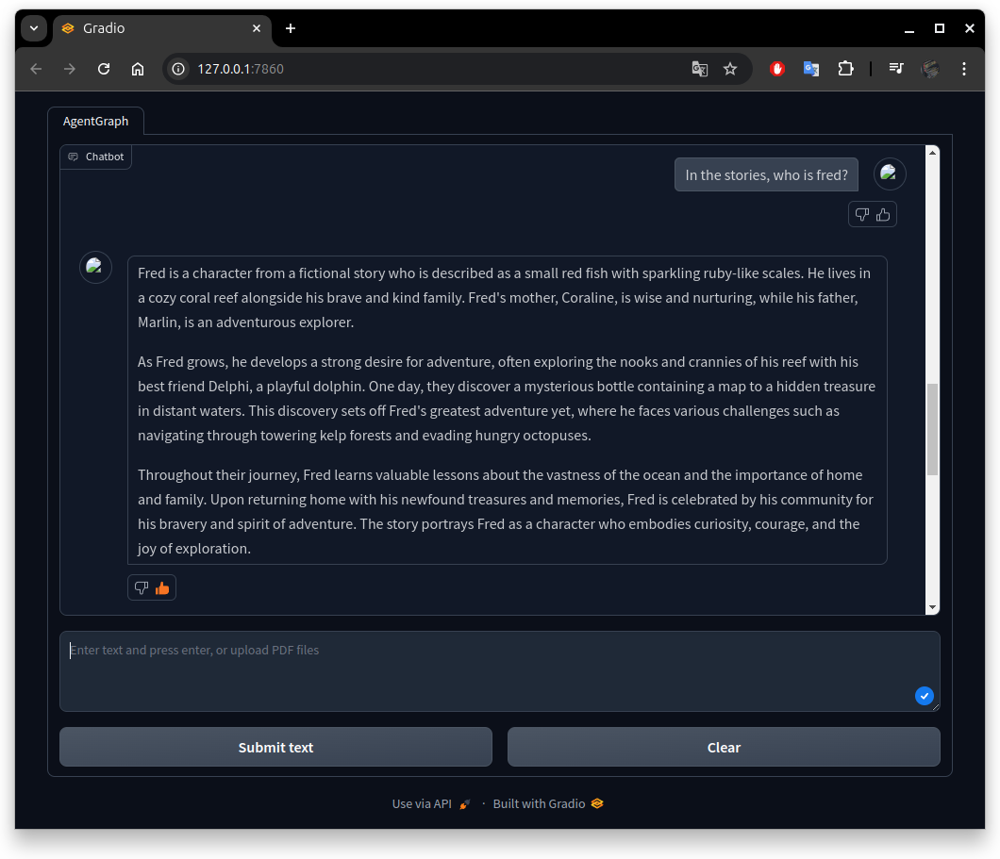

# Intelligent SQL-agent and RAG System for Chatting with Multiple Databases

An advanced conversational AI system that combines Large Language Models (LLMs) with SQL agents to enable natural language interactions with multiple databases. This project demonstrates the implementation of an intelligent chatbot that can effectively query large databases while leveraging various AI tools and frameworks.

## 🌟 Key Features

- Multi-database interaction capability using SQL agents
- Retrieval-Augmented Generation (RAG) system for enhanced responses
- Real-time performance monitoring with LangSmith
- User-friendly chat interface built with Gradio
- Support for both local and cloud-based LLMs
- Vector database integration for efficient information retrieval

## 🛠️ Technology Stack

- **Core Frameworks:**
  - OpenAI
  - LangChain
  - LangGraph
  - LangSmith
  - Gradio

- **LLM Support:**
  - Cloud: OpenAI models
  - Local: Qwen 2.5 14B (via Ollama)

- **Databases:**
  - Chinook Database (SQLite)
  - Additional SQLite databases supported

## 📋 Prerequisites

- Python 3.x
- Tavily API credentials (free tier available)
- LangChain API credentials (free tier available)
- OpenAI API key (for OpenAI models)
- Sufficient storage for local LLM models (if using)

## 🚀 Installation

1. **Create and activate a virtual environment:**
   ```bash
   # Create virtual environment
   python -m venv venv

   # Activate on Windows
   venv\Scripts\activate

   # Activate on Linux/macOS
   source venv/bin/activate
   ```

2. **Install dependencies:**
   ```bash
   pip install -r requirements.txt
   ```

3. **Set up environment variables:**
   Create a `.env` file with the following credentials:
   ```
   OPEN_AI_API_KEY=your_key_here
   TAVILY_API_KEY=your_key_here
   LANGCHAIN_API_KEY=your_key_here
   ```

4. **Prepare databases:**
   - Download the Chinook database from [SQLite Tutorial](https://www.sqlitetutorial.net/sqlite-sample-database/)
   - Place database files in the `data` folder
   - Run the vector database preparation script:
     ```bash
     python src/prepare_vector_db.py
     ```

5. **Launch the application:**
   ```bash
   python src/app.py
   ```



## 💡 Usage

1. After launching the application, access the Gradio interface through the URL displayed in the terminal
2. Start interacting with the chatbot using natural language queries
3. The system will automatically:
   - Parse your questions
   - Generate appropriate SQL queries
   - Retrieve relevant information
   - Provide coherent responses

## 🔍 Performance Notes

- The system performs well with the local Qwen 2.5 14B model
- Response generation time varies based on:
  - Hardware specifications
  - Query complexity
  - Database size
- Current limitations with SQL query generation when using local LLM
- Performance monitoring available through LangSmith interface

## 🎓 Acknowledgments

This project was inspired by the tutorial video ["Automating LLM Agents to Chat with Multiple/Large Databases"](https://youtu.be/xsCedrNP9w8?si=v-3k-BoDky_1IRsg)

## 🔮 Future Improvements

- Optimization of SQL query generation with local LLMs
- Enhanced vector database integration
- Support for additional database types
- Performance optimizations for faster response times
- Extended documentation and usage examples

---
**Note:** For testing additional databases, you can refer to example datasets like [this Kaggle notebook](https://www.kaggle.com/code/dimarudov/data-analysis-using-sql/notebook).
